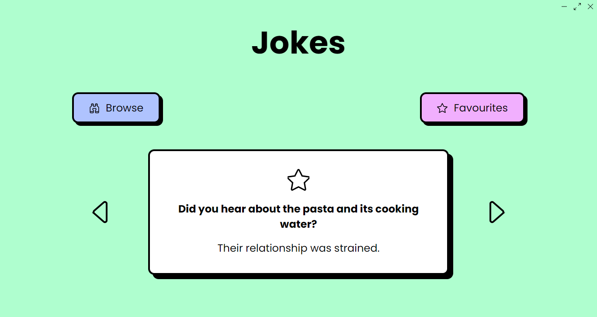

<!-- TODO: Icon and logo -->

# Jokes

An app that remembers your jokes so you don't have to.

## Screenshots



<!-- TODO: Add browse page screenshot -->

## Features

- 150+ jokes (and growing)
- Generate random jokes
- Favorite jokes (however doesn't save yet; see [#12](https://codeberg.org/iwoithe/jokes/issues/12))
- Browse jokes
- Filter jokes by all, favorited, and non-favorited
- Filter jokes out by tag

## Download

For now there are no pre-built binaries. In future Windows, macOS, and Linux builds will be provided.

## Development

### Recommended IDE Setup

[VS Code](https://code.visualstudio.com/) or [VSCodium](https://vscodium.com/) + [Svelte](https://marketplace.visualstudio.com/items?itemName=svelte.svelte-vscode) + [Tauri](https://marketplace.visualstudio.com/items?itemName=tauri-apps.tauri-vscode) + [rust-analyzer](https://marketplace.visualstudio.com/items?itemName=rust-lang.rust-analyzer).

### Development Server

Run the following command in the root directory to start the development server.

```bash
pnpm tauri dev
```

### Build

Run the following command in the root directory to build the release build.

```bash
pnpm tauri build
```

<!-- TODO: Contributing -->

## License

Jokes is released under the GNU General Public License version 3.
